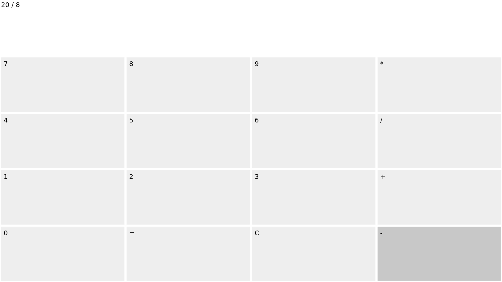
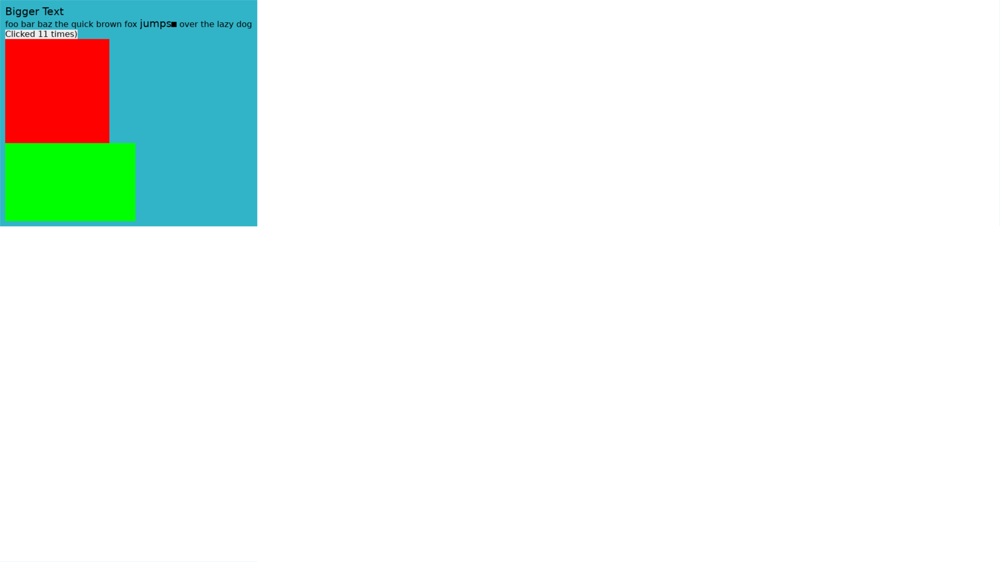

# Moxie Native

**Warning: This is a work in progress and not yet usable for nontrivial applications.**

This is a framework for building GUI applications written in Rust. It
renders using Webrender, instead of relying on other UI toolkits like
Gtk or on a web browser. This gives you control over how your
application looks, but may lose some native look and feel.

The front-facing API is built using [Moxie](https://moxie.rs/), a framework for declaratively
defining UI similar to React.

## Features

- Relatively small footprint (4.8MB for a hello world app).
- Declaratively specify UI instead of manually managing state.
- Not based on immediate mode UI.
- Targetted towards real world desktop applications.
- Styling system for specifying the appearance of elements.

## Future plans

- More powerful layouts (flexbox, flexgrid, etc).
- More user input, such as text fields.
- See here for the current roadmap: https://github.com/tiffany352/moxie-native/projects/1

## Example

```rust
// Get all the types and macros needed for concise code
use moxie_native::prelude::*;

// Define a style for an element. Uses a proc macro for css-like syntax.
const MY_STYLE: Style = define_style! {
    // Easily specify units on measurements, and do simple calculations with them.
    text_size: 25 px + 1 vh,
    padding: 10 px,
    // Enums
    direction: horizontal,
    // Colors allow rgb and rgba syntax.
    background_color: rgb(66, 135, 245),
    text_color: rgb(255, 255, 255),

    // Selectors can be used to add conditional styling.
    if state: hover {
        background_color: rgb(112, 167, 255),
    }
};

// This attribute is used to introduce a new nesting context, which lets the
// runtime efficiently keep track of object states over multiple renders.
#[topo::nested]
// This is the root component, which is expected to return an App element.
fn my_app() -> Node<App> {
    // Declare a state variable, this works kind of like a React useState() hook.
    let click_count: Key<usize> = state!(|| 0);

    // Clone the state so we can access it from the closure.
    let click_state = click_count.clone();
    let on_click = move |_: &ClickEvent| {
        // Updating the state will trigger a re-render.
        click_state.update(|count| Some(count + 1));
    };

    // The mox! macro lets us use nice syntax for declaring elements.
    // This acts like JSX in React.
    mox! {
        <app>
            <window title="Moxie-Native Demo">
                <view>
                    // Every element has a style attribute which can be used to add a style.
                    <button style={MY_STYLE} on={on_click}>
                        // Text can only inside of spans. Attributes and parent-child
                        // relationships are checked at compile time to ensure validity.
                        <span>
                            "Click me! Total clicks: "
                            // Formatting can be done inline using this shorthand syntax.
                            {% "{}", click_count}
                        </span>
                    </button>
                </view>
            </window>
        </app>
    }
}

fn main() {
    // The entrypoint to the application is creating a runtime and starting it.
    let runtime = moxie_native::Runtime::new(|| my_app!());
    runtime.start();
}
```

## Images

What would a GUI crate be without screenshots.

### Calc example

### Readme demo example

### Test example


## License

Mozilla Public License, version 2.

## Contributing

- Agree to license your contribution under the terms of the [license](./LICENSE-MPL).
- Follow the [code of conduct](./CODE_OF_CONDUCT.md).
- Check the issues and projects tabs for things to work on, or ask me (@tiffany352).
